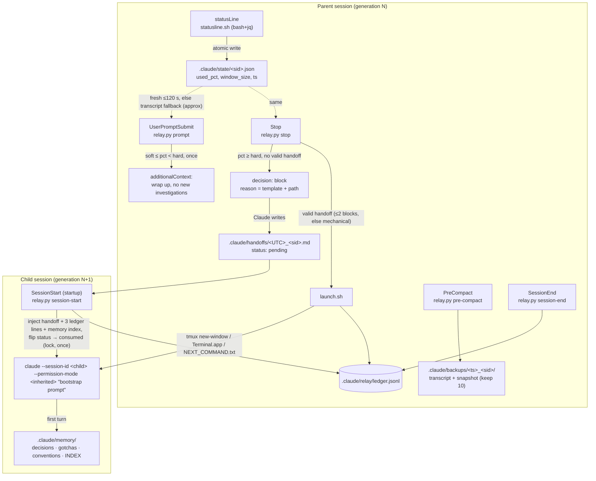

# Session Relay for Claude Code

Keeps long-running work going when a Claude Code session's context window fills up.
A status-line meter measures context use; at the **soft** threshold Claude is told to wrap
up; at the **hard** threshold the Stop hook demands a structured handoff and then starts a
fresh interactive session in the same project that reads the handoff and continues.
Lineage (parent, child, generation) is tracked in a ledger, and durable facts are promoted
into `.claude/memory/`.

Everything is plain `bash` + `jq` (meter), POSIX `sh` (launcher) and one Python 3
stdlib script (hooks). No dependencies beyond what Claude Code already needs, plus `jq`.
What was verified against the official docs and the installed version is recorded in
[RESEARCH.md](RESEARCH.md).

## Architecture



Flow in words:

1. **Meter.** Claude Code runs `statusline.sh` after every assistant message (debounced).
   It takes `context_window.used_percentage` from the documented status-line payload
   (input-only formula), falls back to `total_input_tokens / context_window_size`, and
   writes `.claude/state/<session_id>.json` via temp file + rename. It prints
   `[Model] ctx 42% g1 ~soft` (generation and threshold marker) in about 20 ms.
2. **Reading the meter.** Hooks trust the state file while it is younger than
   `stale_seconds` (120). Otherwise they scan the tail of the transcript for the latest
   main-thread assistant `usage`, sum `input + cache_read + cache_creation`, divide by the
   window size (from an earlier state file, or inferred from the model id / token count)
   and mark the reading `approx`.
3. **Soft trigger (40 %).** `UserPromptSubmit` injects one wrap-up notice per session.
4. **Hard trigger (50 %).** At the end of a turn (never mid-tool) the Stop hook:
   - launches if a valid handoff for this session exists (secrets redacted first);
   - otherwise blocks with the full template and exact path (attempt 1), then with the
     validator's precise errors or a missing-file notice (attempt 2);
   - after `max_block_attempts` writes a **mechanical handoff** (git status, diff --stat,
     recent commits, TODO grep, first prompt, last assistant message) and launches anyway.
   A session that has launched never blocks again.
5. **Launcher.** `launch.sh` takes a `mkdir` lock (stale after 300 s), refuses to launch
   twice for the same handoff, enforces `max_generations` and `cooldown_seconds`, writes a
   runner script and opens it in a new tmux window, else a new Terminal.app/iTerm2 window,
   else writes `.claude/relay/NEXT_COMMAND.txt` and sends a desktop notification.
6. **Child start.** The child was pre-linked by the parent (session id chosen with
   `--session-id`), so `SessionStart` finds its handoff directly, injects it (≤ ~4k
   tokens), flips `status: pending → consumed` under the lock, records lineage, and the
   bootstrap prompt tells Claude to confirm, promote memory items, and continue.

## Install and activate

Project install (committed, shared with the repo):

```bash
sh .claude/relay/bin/install.sh
```

User install (every project on this machine; data still lives per project):

```bash
sh .claude/relay/bin/install.sh --user --project-dir /path/to/project
```

The installer backs up `settings.json` to `settings.json.bak.<UTC>`, merges only the relay
entries (idempotent), seeds `.claude/memory/`, appends `@.claude/memory/INDEX.md` to
`CLAUDE.md` (creating a one-line file if none exists) and adds runtime paths to
`.gitignore`. Flags: `--no-claude-md`, `--no-statusline`, `--no-gitignore`, `--dry-run`.

Then **start a new session** in the project. Hooks in a project's `.claude/settings.json`
require the workspace to be trusted. Claude Code also hot-reloads settings, so a running
session in that directory picks the hooks up immediately.

What gets wired:

| Event | Command | Timeout |
| --- | --- | --- |
| statusLine | `bash "${CLAUDE_PROJECT_DIR:-.}"/.claude/relay/bin/statusline.sh` | n/a |
| `UserPromptSubmit` | `python3 …/relay.py prompt` | 10 s |
| `Stop` | `python3 …/relay.py stop` | 120 s |
| `SessionStart` (all sources) | `python3 …/relay.py session-start` | 30 s |
| `PreCompact` | `python3 …/relay.py pre-compact` | 60 s |
| `SessionEnd` | `python3 …/relay.py session-end` | 10 s |

Uninstall: `sh .claude/relay/bin/uninstall.sh [--user] [--purge]` removes exactly those
entries and the `CLAUDE.md` pointer; `--purge` deletes runtime data but never `.claude/memory`.

## Configuration (`.claude/relay/config.json`)

| Key | Default | Meaning |
| --- | --- | --- |
| `enabled` | `true` | Master switch. `CLAUDE_RELAY_DISABLE=1` in the environment also disables everything. |
| `soft` / `hard` | `40` / `50` | Context-use percentages for the wrap-up notice and the handoff. |
| `max_generations` | `8` | Chain length limit; beyond it the chain stops and you are notified. |
| `cooldown_seconds` | `60` | Minimum time between launches in a project; a launch inside the window is retried at the next stop. |
| `stale_seconds` | `120` | Age after which the status-line state is distrusted and the transcript fallback is used. |
| `dry_run` | `false` | Everything runs (blocks, handoffs, ledger) but the launcher only plans. |
| `close_old_session` | `false` | tmux only: kill the parent pane 2 s after launching the child. |
| `max_handoff_words` | `2500` | Validator limit (+10 % tolerance). |
| `max_block_attempts` | `2` | Blocks before the mechanical handoff is used. |
| `inject_budget_chars` | `16000` | Cap for the SessionStart injection (≈ 4k tokens). |
| `backups_keep` | `10` | PreCompact backups retained per project. |
| `launcher.mode` | `auto` | `auto`, `tmux`, `terminal`, `file`. |
| `launcher.terminal_app` | `Terminal` | `Terminal` or `iTerm` (macOS). |
| `launcher.claude_bin` | `claude` | Binary used for the child. Set to `$CLAUDE_CODE_EXECPATH`'s value to reuse the Desktop app's bundled CLI. |
| `launcher.allow_bypass_inherit` | `false` | Whether a parent in `bypassPermissions` may pass that mode to the child. |
| `launcher.lock_stale_seconds` | `300` | Lock age after which it is reclaimed. |

`CLAUDE_RELAY_CONFIG=<file>` overrides the config path (tests and simulations use it);
`CLAUDE_RELAY_DEBUG=1` mirrors the log to stderr; `CLAUDE_RELAY_LAUNCHER=<script>`
substitutes the launcher.

## Permission handling

The child starts with `--permission-mode <mode of the parent>`, taken from the
`permission_mode` field every hook payload carries. `--dangerously-skip-permissions` is
never added. A parent in `bypassPermissions` produces a child in `default` (Manual) mode
unless `launcher.allow_bypass_inherit` is `true`; the downgrade is logged.

Trade-off: a child in Manual or `acceptEdits` mode will stop and ask you before running
commands, so a relay chain is only hands-off if the parent already ran in `auto`
(classifier-reviewed) mode, which the child inherits when your account is eligible. If
auto mode is unavailable, Claude Code starts the child in Manual mode. The alternative,
inheriting bypass automatically, would silently widen what an unattended session may do,
which is why it is opt-in.

## Try it end to end

Simulation (no Claude session is started, launcher in `file` mode, thresholds 1 % / 2 %):

```bash
bash tests/e2e/run_simulation.sh
```

```bash
bash tests/e2e/run_simulation.sh --mechanical
```

Live test on a trivial task. In the project, lower the thresholds so the first turn
crosses them, then start a session **from a terminal** (so the new window appears next to it):

```bash
python3 - <<'EOF'
import json; p=".claude/relay/config.json"; c=json.load(open(p)); c.update(soft=1, hard=1); json.dump(c, open(p,"w"), indent=2)
EOF
```

```bash
claude "List the files in this project and summarize what the relay does."
```

Expected: after the first answer the Stop hook blocks and Claude writes
`.claude/handoffs/<UTC>_<session>.md`; when it stops again, a new tmux window or
Terminal.app window opens with generation 1, whose first message is the bootstrap prompt
and whose context contains the handoff; the handoff's status flips to `consumed`;
`.claude/relay/ledger.jsonl` shows `handoff_requested → handoff_launched →
handoff_consumed`. Restore `soft: 40, hard: 50` afterwards (or `git checkout
.claude/relay/config.json`).

Unit tests (stdlib `unittest`, ~2 minutes of sandboxed temp projects):

```bash
cd tests && python3 -m unittest -v
```

## Files

```
.claude/settings.json              hook + statusLine wiring (project install)
.claude/relay/config.json          thresholds and switches
.claude/relay/handoff-template.md  the nine-section template with front matter
.claude/relay/bin/relay.py         hooks, meter fallback, validator, ledger, utilities
.claude/relay/bin/statusline.sh    meter + status line
.claude/relay/bin/launch.sh        launcher
.claude/relay/bin/install.sh       installer (project or --user)
.claude/relay/bin/uninstall.sh     uninstaller
.claude/relay/ledger.jsonl         append-only lineage log         (gitignored)
.claude/relay/relay.log            rotating log, 1 MB x 3           (gitignored)
.claude/relay/launched/, run/      idempotency markers, runner scripts (gitignored)
.claude/state/<sid>.json           meter state (owned by statusline.sh)
.claude/state/<sid>.relay.json     hook state: attempts, generation, parent, child, launched
.claude/handoffs/                  handoffs                          (gitignored)
.claude/backups/                   PreCompact snapshots             (gitignored)
.claude/memory/                    INDEX.md, decisions.md, gotchas.md, conventions.md (committed)
```

Ledger entry: `{ts, session_id, parent, generation, event, used_pct, handoff_path,
git_head, …}` with events `soft_trigger`, `handoff_requested`, `handoff_requested_again`,
`handoff_invalid`, `mechanical_handoff`, `handoff_launched`, `launch_dry_run`,
`launch_deferred`, `launch_cooldown`, `limit_reached`, `launch_failed`,
`handoff_consumed`, `pre_compact`, `session_end`. Launch events are written by the parent
but carry the generation being launched, so a chain reads `gen=0 handoff_requested →
gen=1 handoff_launched → gen=1 handoff_consumed`.

## Useful commands

```bash
python3 .claude/relay/bin/relay.py status
```

```bash
python3 .claude/relay/bin/relay.py meter --session-id <sid> --transcript ~/.claude/projects/<project>/<sid>.jsonl
```

```bash
python3 .claude/relay/bin/relay.py validate .claude/handoffs/<file>.md
```

```bash
python3 .claude/relay/bin/relay.py reset --session-id <sid>
```

`reset` re-arms a session that already launched (for example after you closed the child
window) so its next stop can launch again.

## Troubleshooting

- **Nothing happens at 50 %.** Check `.claude/relay/relay.log` for `stop: meter` lines:
  `used_pct` null means neither the status line nor the transcript gave a reading. Confirm
  `jq` is installed and that `statusLine` in settings is the relay's (another status line
  wins if you set one at a higher-precedence scope). `relay disabled` means
  `enabled:false` or `CLAUDE_RELAY_DISABLE=1`.
- **Claude keeps getting blocked.** The relay blocks at most twice per session; the log
  shows `handoff_invalid` with the validator's errors. Claude Code itself also overrides a
  Stop hook after eight consecutive blocks.
- **The child never appeared.** The ledger says why: `launch_deferred` (no terminal; run
  the command in `.claude/relay/NEXT_COMMAND.txt`), `launch_cooldown`, `limit_reached`,
  or `launch_failed` with the launcher's stderr. Terminal.app launches need Automation
  permission for the process hosting Claude Code the first time.
- **The child started without the handoff.** The `SessionStart` hook logs
  `no pending handoff`; check the handoff's `status:` line (`consumed` means another
  session took it) and `launched_child`. Handoffs linked to a child that never started
  become claimable by any new session after five minutes.
- **Wrong percentage right after `/compact`.** Expected briefly: the `compact` SessionStart
  marks the state stale and the transcript fallback takes over until the next response.
- **Hooks did not load.** Run `/hooks` in the session to see what is configured, and
  `claude --debug` to see hook stdout/stderr. Project hooks need a trusted workspace.

## Known limitations

- **Desktop app sessions.** A session hosted by the Claude Desktop app (or VS Code) can run
  the hooks, but the relayed child opens as a CLI session in tmux or Terminal.app, not
  inside the app. The Desktop app can later resume that session by id. A `--desktop`
  launcher mode is not provided: the installed CLI (2.1.280) predates the flag and it
  cannot carry a bootstrap prompt.
- **The parent window stays open.** The parent session idles after launching. With tmux
  and `close_old_session: true` its pane is killed two seconds after the launch; there is
  no safe equivalent for Terminal.app windows.
- **One turn of latency.** Stop fires at the end of a turn, so the handoff is requested at
  the end of the turn in which usage crossed the threshold, never mid-tool.
- **Transcript format is internal.** The fallback meter parses `~/.claude/projects/...jsonl`,
  which Claude Code documents as unstable. It is only used when the status-line state is
  missing or stale, and readings are flagged `approx`.
- **Window size inference.** The transcript does not record the window size; without a
  state file the fallback assumes 200k unless the token count or model id proves 1M.
- **Secret redaction is pattern-based.** Known token shapes, `key=value` and `.env`-style
  lines are redacted; it is not a guarantee. Handoffs are gitignored by default.
- **Auto memory.** Claude's own auto memory is disabled in sessions started by another
  Claude Code session; the launcher scrubs the nested-session environment markers and
  starts the child from a fresh shell, but this is inferred, not documented behaviour.
- **Permission inheritance** follows the parent's mode exactly (see above); a Manual-mode
  parent yields a Manual-mode child that will prompt you.
